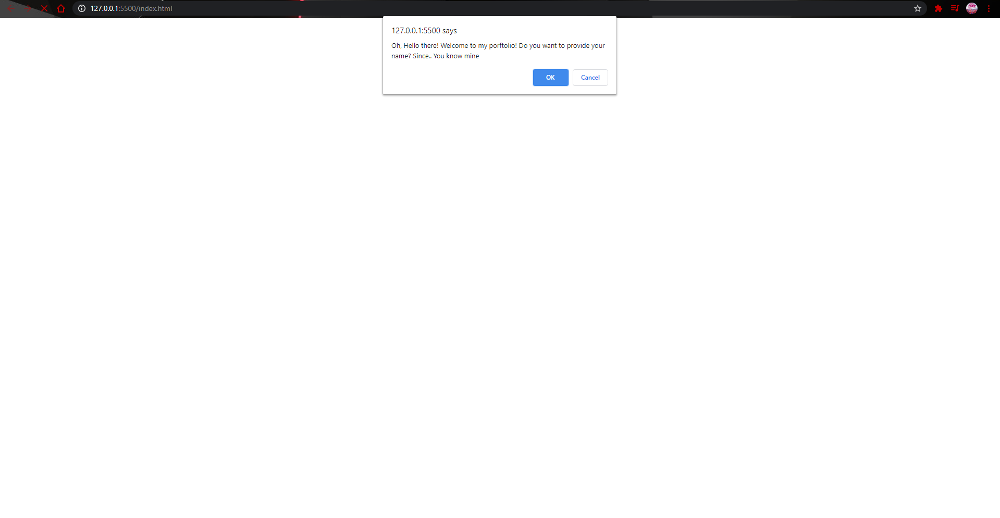

# Welcome to my Briefcase!

 This is my portfolio, where I will be updating my projects that are to come. This page took me a good amount of hours but i am happy with the final result. That being said, let me guide you through.

 Right here we have a look to what the page is!
 ## First Page!

 
 
 
 ## Second Page!
 

 

## Third Page!

## Some JAVASCRIPT!

As you can see this time, i tried to go beyond! And hey, for just having 3 weeks of learning. I will say it is pretty good!.
But of course, you need to live the experience! Go ahead and try it for yourself!

[https://chasewalker23.github.io/My-Briefcase/]
[https://github.com/Chasewalker23/My-Briefcase]
